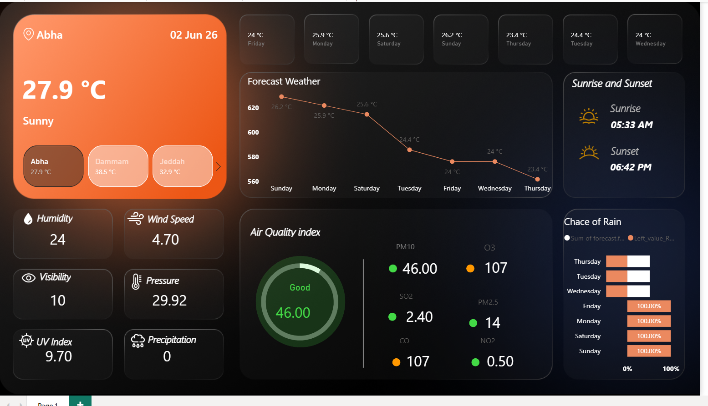

# Saudi Arabia Weather Dashboard

## 📊 Project Overview
An interactive and modern Power BI dashboard designed to monitor and analyze live weather metrics, forecasts, and air quality index (AQI) across key regions in Saudi Arabia (Riyadh, Jeddah, Abha, Dammam, and Tabuk).

## 📷 Dashboard Preview

## 💡 Key Features
* **Live Weather Metrics:** Real-time tracking of temperature, humidity, wind speed, visibility, and UV index.
* **Forecast & Trends:** Interactive charts showing multi-day temperature forecasts and daily sunrise/sunset schedules.
* **Air Quality & Rain Analysis:** Comprehensive monitoring of AQI metrics (PM10, O3, SO2) and precipitation probabilities.
* **Regional Navigation:** Dynamic slicers and custom cards to seamlessly switch between the selected Saudi cities.

## 🛠️ Tools Used
* **Power BI:** Data Ingestion, DAX Measures, and Custom UI/UX Dashboard Design.
